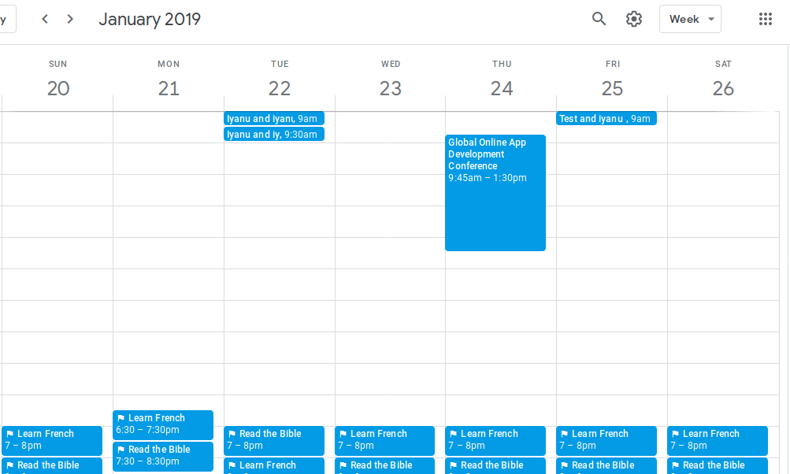

# calendar-plus

Calendar-plus is a simple library for creating HTML Calendar that includes query objects. 

This is an example of what the library allows you to do. 




## Installation

```commandline
pip install calendar-plus
```


## How to use

So you have a class for an event object that looks something like below. This example is based on Django
framework. 

```python

class Event(models.Model):
    name = models.CharField()
    time = model.TimeField()
    date = models.DateField()

```

The query is `events = Event.objects.filter(date__year=year, date__month=month)`

Using the library

```python
from calendarplus import ModelCalendar

calendar = ModelCalendar(year=month, month=month).formatmonth(events)

context['calendar'] = calendar

return context
```

You can now use the context_object_name in your template. This library requires bootstrap framework to 
render beautifully. You can override the formatmonth to use your own css class. 


